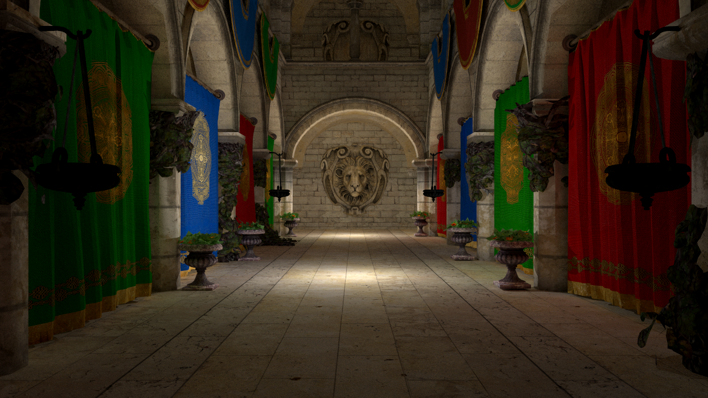

# RayTracer
My ray tracer project with many features including:
- Depth of Field, Soft Shadows, Glossy Reflections and Motion Blur
- 7 Different BRDF models
- Bounding Volume Hierarchy, Multisampling and Refraction
- 5 Different Light Implementation and Reinhard Tone Mapping
- Texture and Bump Mapping
- Path Tracing

All outputs and implementation details are in https://akcayalperen.wordpress.com/

